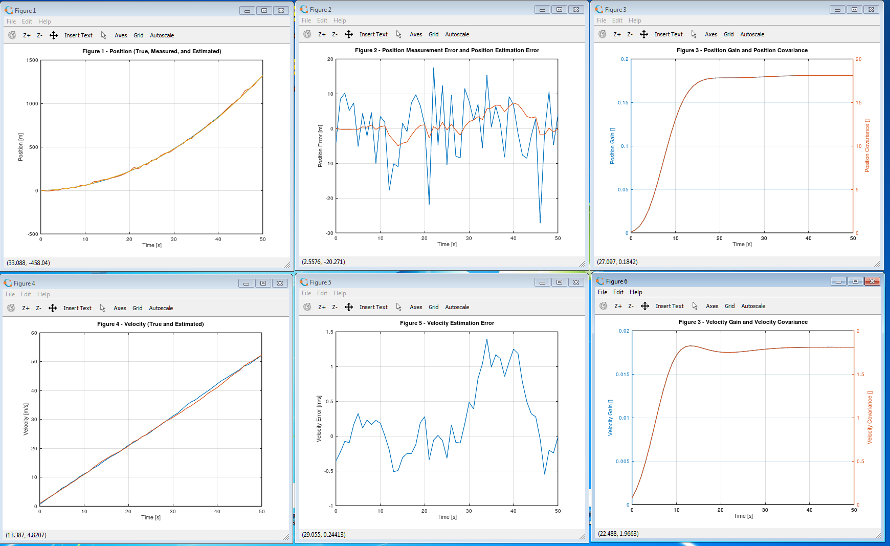

# kalman-estimator - a Kalman estimator in C++

**Contents**  

- [Example usage](#example-usage)
- [In a nutshell](#in-a-nutshell)
- [Basic Kalman estimator code](#basic-kalman-estimator-code)
- [Notes and references](#notes-and-references)

<!-- 
- [License](#license)
- [Dependencies](#dependencies)
- [Installation](#installation)
- [Synopsis](#synopsis)
- [Features](#features)
- [Reported to work with](#reported-to-work-with)
- [Building the tests](#building-the-tests)
- [Other implementations of any](#other-implementations-of-any)
- [Appendix](#appendix) -->


Example usage
-------------

```C++
// Prepare variables...

// Create Kalman estimator:

kalman estim(
    dt          // time step
    , A         // system dynamics matrix: state-k-1 => state-k
    , B         // control input matrix: control => state
    , H         // measurement output matrix: state => measurement
    , Q         // process noise covariance
    , R         // position measurement noise covariance
    , P         // initial estimate error covariance
    , xhat      // initial system state estimate
);

// Use the estimator, feed it a constant acceleration, system noise and a noisy measurement:

for ( int i = 0; i*dt < T; ++i )
{
    // Use a constant commanded acceleration of 1 meter/s^2:
    const kalman::u_t u = {1};

    // Simulate the linear system:
    x = A * x + B * u + process_noise( dt, accelnoise );

    // Simulate the noisy measurement:
    auto z = H * x + meas_noise( measnoise );

    // Process a time-step:
    estim.update( u, z );
}
```


In a nutshell
-------------
Try and gain familiarity with the Kalman estimator. The intention is to implement a control system using a Kalman estimator in C++ on a small computer board like the [Adafruit Pro Trinket](https://www.adafruit.com/products/2010) and control the positioning of a spring&ndash;mass system with it.  

Plan:
- [x] Create a Matlab program with a basic Kalman estimator. 
- [x] Translate Matlab code to C++ using a recent C++ standard (C++14, C++17). 
- [x] Write a supporting matrix library.
- [ ] Write a supporting fixed-point library.
- [ ] Design a simple setup to control via an Arduino-like board (spring&ndash;mass positioning).
- [ ] If needed, create a version of the existing code to compile for an older C++ standard;
  this depends on the processor type on the computer board and the compiler(s) available for it.
- [ ] Create a demo application for the setup that implements a conventional PID controller.
- [ ] Create a demo application for the setup that implements a controller that uses the Kalman estimator.
- [ ] To reduce the computational load, implement (automatic) transitioning to a fixed Kalman gain after it has stabilized.
- [ ] Asses possible bottlenecks in the C++ code that may be easy to avoid via the [Godbolt](https://godbolt.org/) online compiler.
- [ ] ...

Some information on the [Adafruit Pro Trinket](https://www.adafruit.com/products/2010) board may be obtained from the project [Moon Phase Calendar for Arduino, using Pro Trinket](https://github.com/MarkMoene/MoonPhaseCalendar).


Basic Kalman estimator code
---------------------------

```C++
void update( u_t const & u, z_t const & z )
{
	// --------------------------------------
	// 1. Predict (time update)
	
	// 1a: Project the state ahead:
	xhat = A * xhat + B * u;
	
	// 1b: Project the error covariance ahead:
	P = A * P * transposed(A) + Q;
	
	// --------------------------------------
	// 2. Correct (measurement update)
	
	// 2a: Compute the Kalman gain:
	K = P * transposed(H) * inverted(H * P * transposed(H) + R);
	
	// 2b: Update estimate with measurement:
	xhat = xhat + K * (z - H * xhat);
	
	// 2c: Update the error covariance:
	P = (I() - K * H) * P;
}
```
  


Graph for a simulation run with the resulting (estimated) position, (estimated) velocity, errors and Kalman gains.


Notes and References
--------------------
Various articles, video's, books to read up on the Kalman estimator.
 
[1] Wikipedia. [Kalman filter](https://en.wikipedia.org/wiki/Kalman_filter).

[2] Greg Welch and Gary Bishop. [An Introduction to the Kalman Filter](www.cs.unc.edu/~welch/media/pdf/kalman_intro.pdf) (PDF).

[3] Greg Welch. [Page on The Kalman Filter](http://www.cs.unc.edu/~welch/kalman/).

[4] Simon D. Levy. [The Extended Kalman Filter: An Interactive Tutorial for Non-Experts](http://home.wlu.edu/~levys/kalman_tutorial/).

[5] Bilgin Esme. [Kalman Filter For Dummies - A mathematically challenged man's search for scientific wisdom](http://bilgin.esme.org/BitsAndBytes/KalmanFilterforDummies).

[6] Mayitzin. [Kalman Filter – A painless approach](https://mayitzin.com/2015/06/04/kalman-filter-a-painless-approach/).

[7] Tucker McClure. How Kalman Filters Work, [part 1](http://www.anuncommonlab.com/articles/how-kalman-filters-work/), [part 2](http://www.anuncommonlab.com/articles/how-kalman-filters-work/part2.html), [part 3](http://www.anuncommonlab.com/articles/how-kalman-filters-work/part3.html) ([Code on MathWorks](https://www.mathworks.com/matlabcentral/fileexchange/56652-particle--sigma-point--and-kalman-filters)).

[8] Tucker McClure. [How Simulations Work](http://www.anuncommonlab.com/articles/how-simulations-work/).

[9] Demofox. [Incremental Least Squares Curve Fitting](https://blog.demofox.org/2016/12/22/incremental-least-squares-curve-fitting/) (Contains C++ code).

[10]  Kristian Sloth Lauszus. [A practical approach to Kalman filter and how to implement it](http://blog.tkjelectronics.dk/2012/09/a-practical-approach-to-kalman-filter-and-how-to-implement-it/) (Contains C code).

[11] Dan Simon. [Optimal State Estimation: Kalman, H-infinity, and Nonlinear Approaches](http://academic.csuohio.edu/simond/estimation/). ([Code from the book]())

[12] iLectureOnline. [Lectures in The Kalman Filter](http://www.ilectureonline.com/lectures/subject/SPECIAL%20TOPICS/26) (42 videos of 6 minutes).